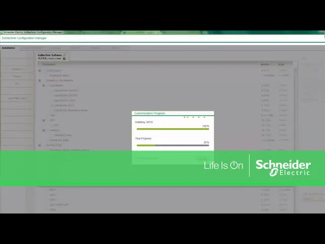

# Adding-M218-Controllers-to-SoMachine-via-Configuration-Manager-｜-Schneider-Electric-Support

> 🆓 **نسخه رایگان** - کیفیت 360p
> برای کیفیت بالاتر، MP3، زیرنویس و رمزگذاری به [workflow شماره 01](../../actions) بروید

  <picture>
    
  </picture>

---

## Video Information

| Property | Value |
|----------|-------|
| **Video Name** | `Adding-M218-Controllers-to-SoMachine-via-Configuration-Manager-｜-Schneider-Electric-Support` |
| **Original Link** | [YouTube Video](https://www.youtube.com/watch?v=wQm8Kf4dthI) |
| **Total Size** | **2.38 MB** |
| **Quality** | **360p (Free)** |

---

## Download Link

| # | File | Link |
|---|------|------|
| 1 | `Adding-M218-Controllers-to-SoMachine-via-Configuration-Manager-｜-Schneider-Electric-Support.mp4` | [Download](https://raw.githubusercontent.com/aminaminsalehi/Ourtube/main/videos/Adding-M218-Controllers-to-SoMachine-via-Configuration-Manager-%EF%BD%9C-Schneider-Electric-Support/Adding-M218-Controllers-to-SoMachine-via-Configuration-Manager-%EF%BD%9C-Schneider-Electric-Support.mp4) |

---

*🆓 Free Version - [avasam.ir](https://avasam.ir)*
