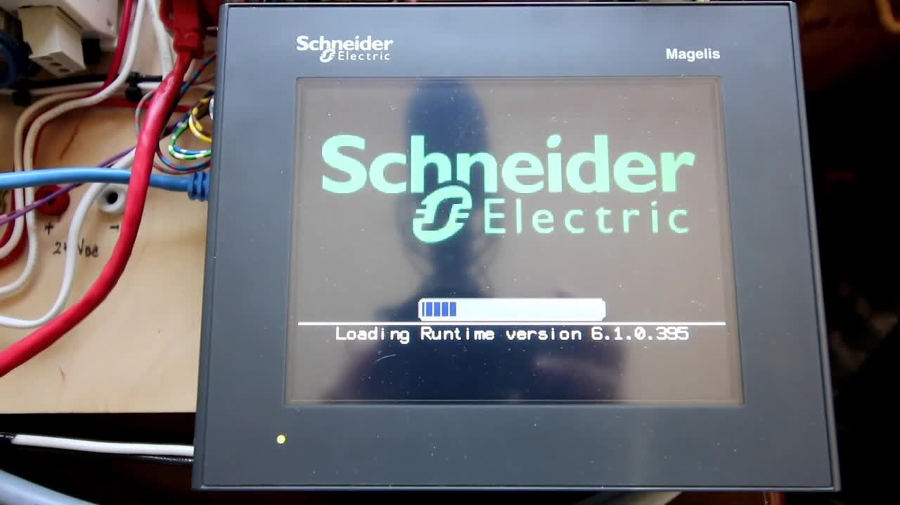

# Vijeo-Designer-Tutorial-#2-(Magelis-HMI)-Creating-Pushbuttons-that-control-Indicator-Lights

> 🆓 **نسخه رایگان** - کیفیت 360p
> برای کیفیت بالاتر، MP3، زیرنویس و رمزگذاری به [workflow شماره 01](../../actions) بروید

  <picture>
    
  </picture>

---

## Video Information

| Property | Value |
|----------|-------|
| **Video Name** | `Vijeo-Designer-Tutorial-#2-(Magelis-HMI)-Creating-Pushbuttons-that-control-Indicator-Lights` |
| **Original Link** | [YouTube Video](https://www.youtube.com/watch?v=eTzPt9Olz00) |
| **Total Size** | **39.84 MB** |
| **Quality** | **360p (Free)** |

---

## Download Link

| # | File | Link |
|---|------|------|
| 1 | `Vijeo-Designer-Tutorial-#2-(Magelis-HMI)-Creating-Pushbuttons-that-control-Indicator-Lights.mp4` | [Download](https://raw.githubusercontent.com/aminaminsalehi/Ourtube/main/videos/Vijeo-Designer-Tutorial-%232-%28Magelis-HMI%29-Creating-Pushbuttons-that-control-Indicator-Lights/Vijeo-Designer-Tutorial-%232-%28Magelis-HMI%29-Creating-Pushbuttons-that-control-Indicator-Lights.mp4) |

---

*🆓 Free Version - [avasam.ir](https://avasam.ir)*
